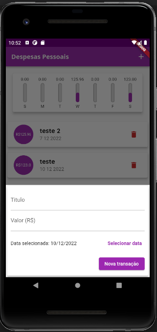

# Learning Flutter

## Project 1 - ["Perguntas"](./projeto_perguntas/)

<table>
    <tr>
        <td></td>
        <td></td>
    </tr>
</table>

## Project 2 - ["Dispesas pessoais"](./expenses/)

<table>
    <tr>
        <td></td>
        <td></td>
    </tr>
</table>

## Project 3 - ["Refeições"](./meals/)

...